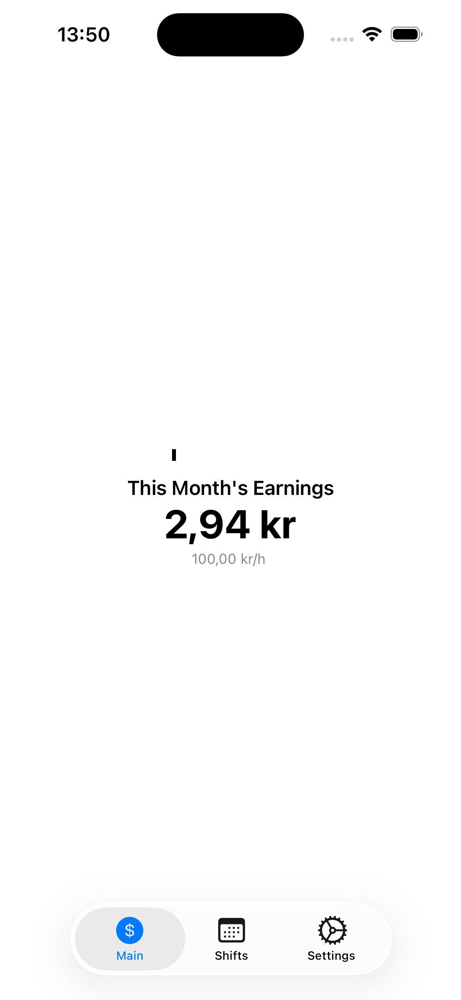
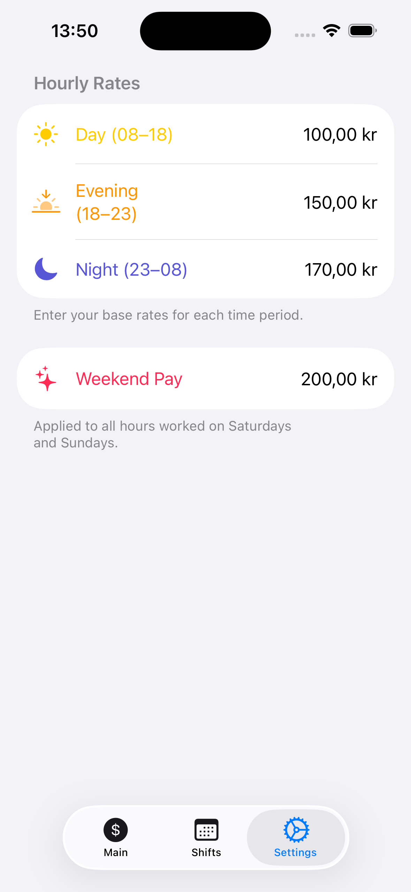
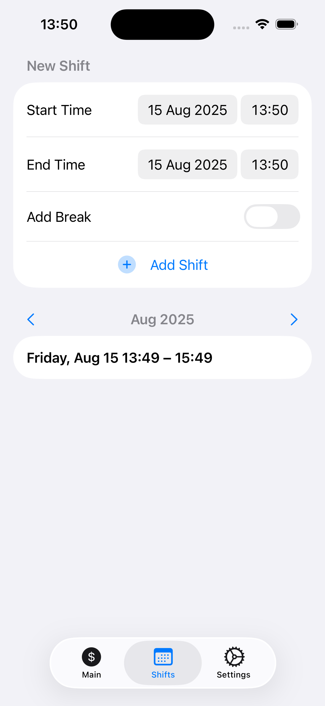

# Shift & Earnings Tracker

A SwiftUI iOS application to track work shifts, calculate earnings in real time, and manage hourly rate settings.  
Supports different rates for day, evening, night, and weekends, with optional unpaid breaks.

# Screenshots

  
  
  

## Features

- **Shift Management**
  - Add, edit, and delete work shifts.
  - Supports start/end times and optional unpaid breaks.
  - Entire row tap for quick editing.
  
- **Real-Time Earnings**
  - Calculates total earnings for the current month in real time.
  - Different rates for:
    - Day (08:00–18:00)
    - Evening (18:00–23:00)
    - Night (23:00–08:00)
    - Weekends (Saturday & Sunday)
  - Handles unpaid breaks by splitting the shift into paid segments.

- ⚙ **Settings**
  - Adjustable hourly rates for each time period.
  - Currency formatting applied automatically when leaving the input field.
  - Weekend bonus support.

- 📊 **Monthly Totals**
  - Displays total earned for past months at the bottom of the list.
  - Excludes upcoming months from earnings view.
